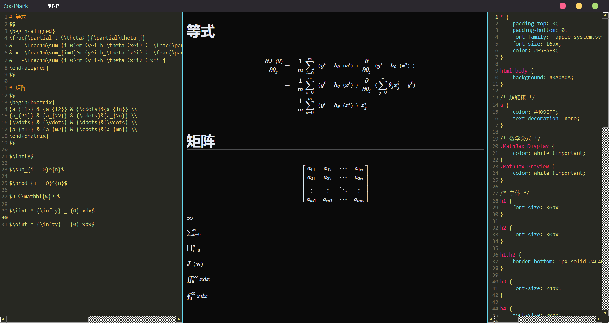

# CoolMark🔥🔥🔥

**一款小型MarkDown编辑器，使用 `Monokai` 风格制作**<br>
**编辑 `markdown` 和 `css` 时可实时刷新用于显示的html内容**

**CoolMark2.0现已更新,CoolMark2.0地址:https://github.com/JustOneYounger/CoolMark2.0**

- **可执行软件下载链接:** https://www.123684.com/s/LKlZTd-ZmIvd
- **下载备用链接:** https://www.123865.com/s/LKlZTd-ZmIvd
- **CoolMark2.0 可执行软件下载链接**: [https://www.123684.com/s/LKlZTd-ZmIvd](https://www.123684.com/s/LKlZTd-2fIvd)
- **CoolMark2.0 下载备用链接**: [https://www.123865.com/s/LKlZTd-ZmIvd](https://www.123865.com/s/LKlZTd-2fIvd)

*软件依靠python进行markdown转义,部分markdown转为html存在不足,欢迎各位修改讨论*

|QT|QT6.5.3 msvc2019_64|
|--|--|
|Visual Studio|Visual Studio 2022|
---

## 文件介绍

- **1.Resources内为资源文件**

包括 `MarkDownToHtml.py` , `coolmark_style.css` 和程序运行图标( `MarkDownToHtml.py` 经过 `pyinstaller` 编译后即可在程序内使用)

`MarkDownToHtml.py` 的使用方式为 `MarkDownToHtml.exe [inputfile] [outputfile]`

- **2.SourceCode内为程序源码**

在Visual Studio 2022内新建一个QT工程后可加入并执行(QT启用 `QWebEngine` 和 `QWebEngineWidgets` )

确保vs项目可以正确编译并执行所有文件

## 数学公式编辑

markdown转义为html依靠python的 `markdown` 库实现,且加入了 `mdx_math` 使其可以解析数学公式

在主程序中对于`html`文件的<head>部分,引入
```html
<script type="text/x-mathjax-config">MathJax.Hub.Config({config:["MMLorHTML.js"],jax:["input/TeX","output/HTML-CSS","output/NativeMML"],extensions:["MathMenu.js","MathZoom.js"]});</script>
<script type="text/javascript" src="https://cdn.staticfile.org/mathjax/2.7.7/MathJax.js"></script>
```
用于解析渲染$...$或者$$...$$的数学公式标签

效果展示:



## 备注

`CSS` 每次编写都会进行保存
  
本意是让各位可以自定义独属于自己的样式表,并在下一次启动程序时直接用自己写好的样式表

欢迎各路大佬自由发挥艺术天赋,打造自己的markdown主题搭配

## 程序快捷键:

|快捷键|功能|
|--|--|
|Ctrl O|打开markdown文件|
|Ctrl S|保存markdown文件|
|Ctrl L|打开临时html到浏览器|
|F12|清空markdown编辑器|
|F10|导出PDF文件|
